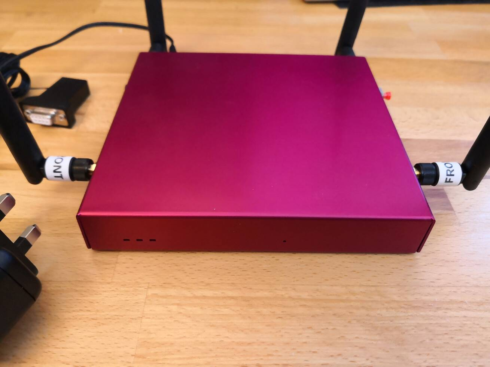
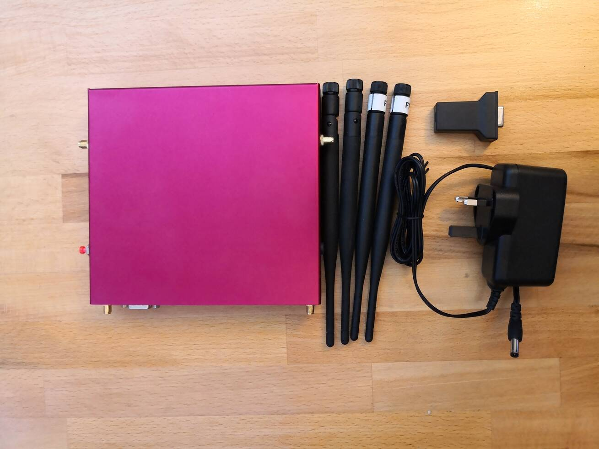
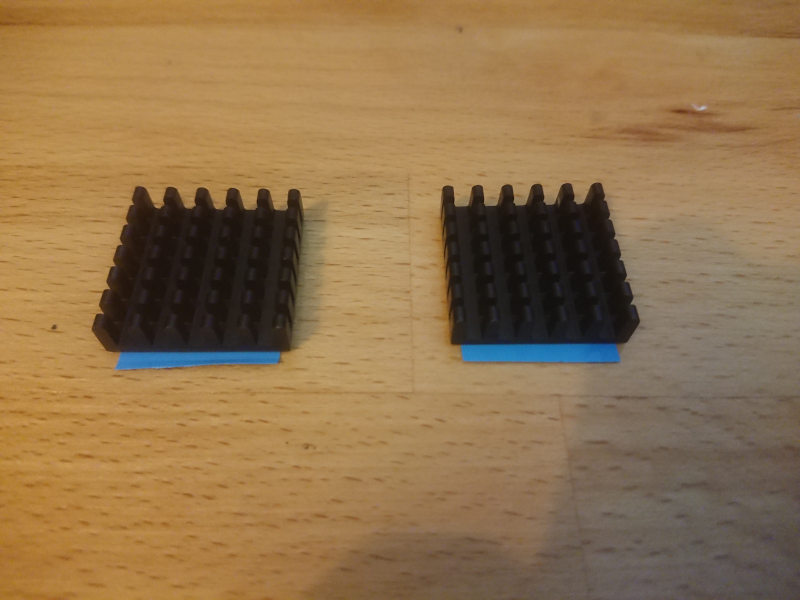
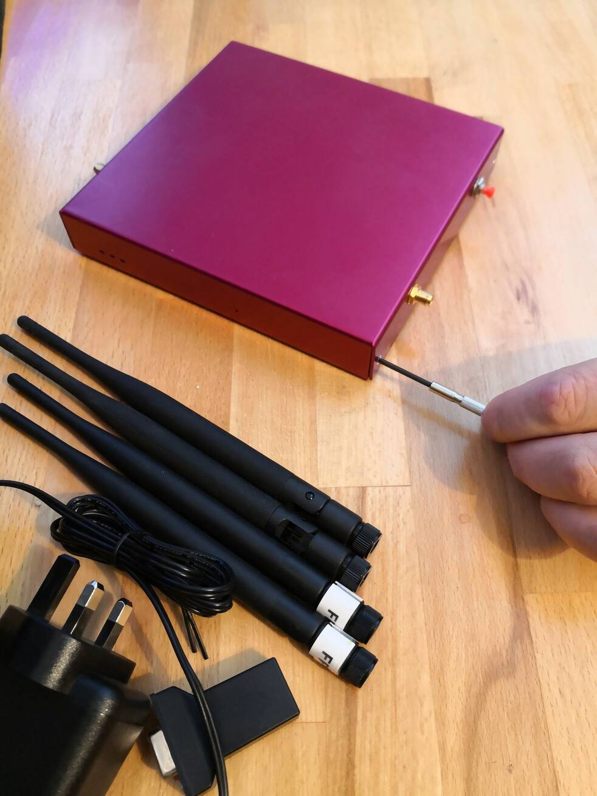
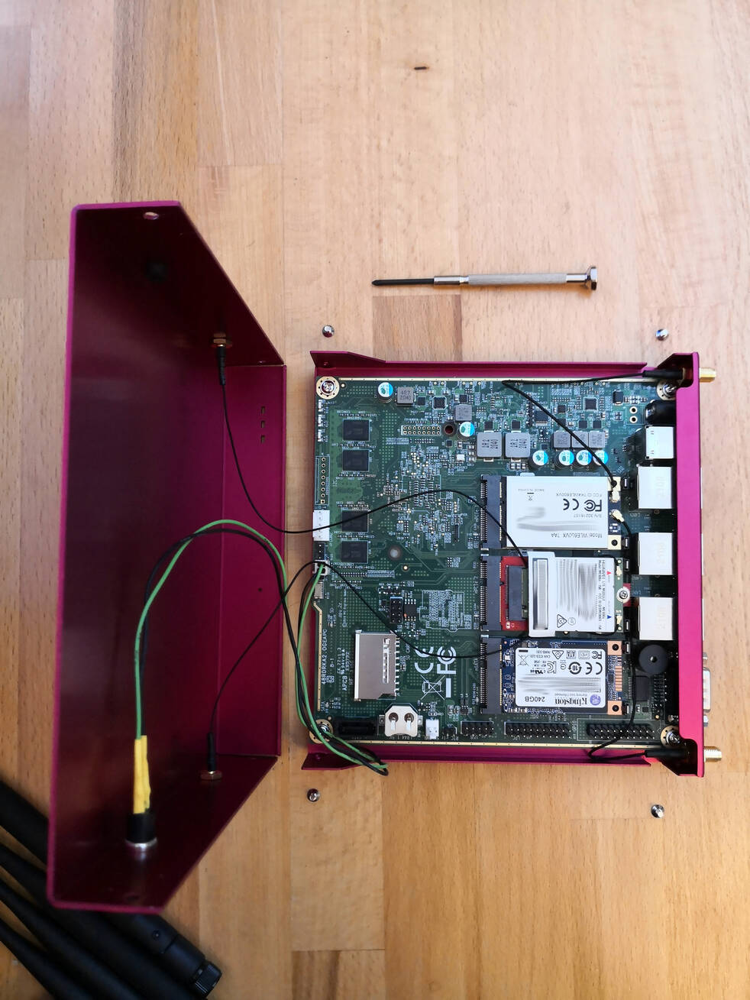
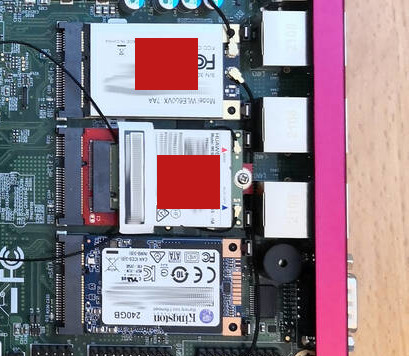
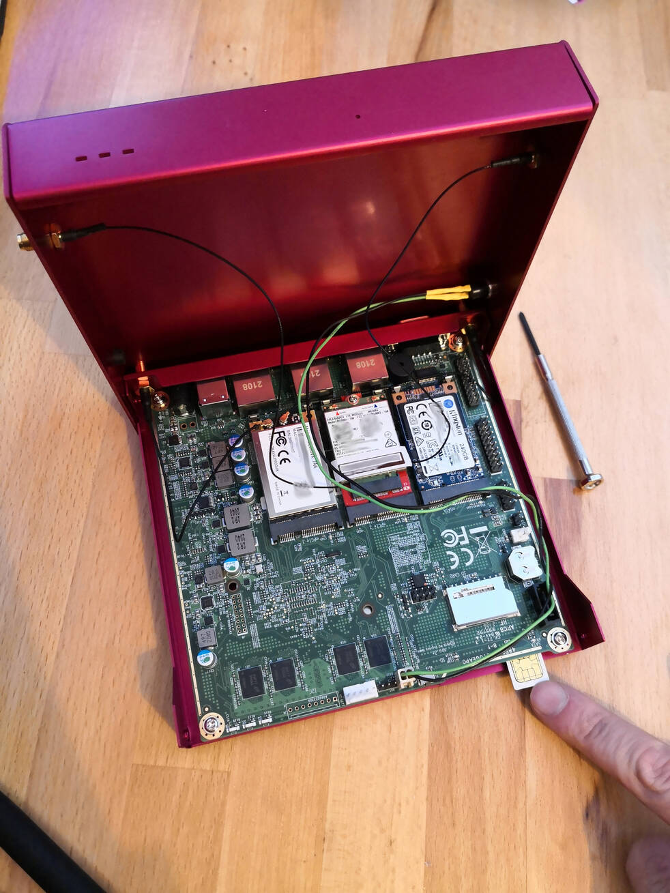
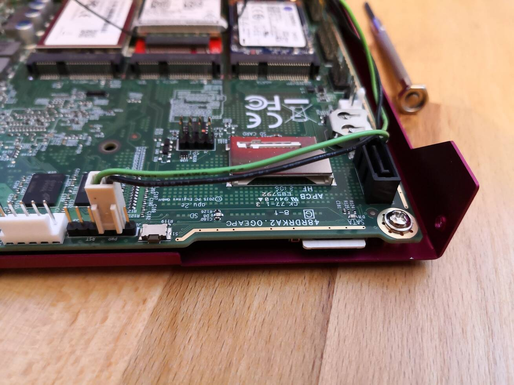
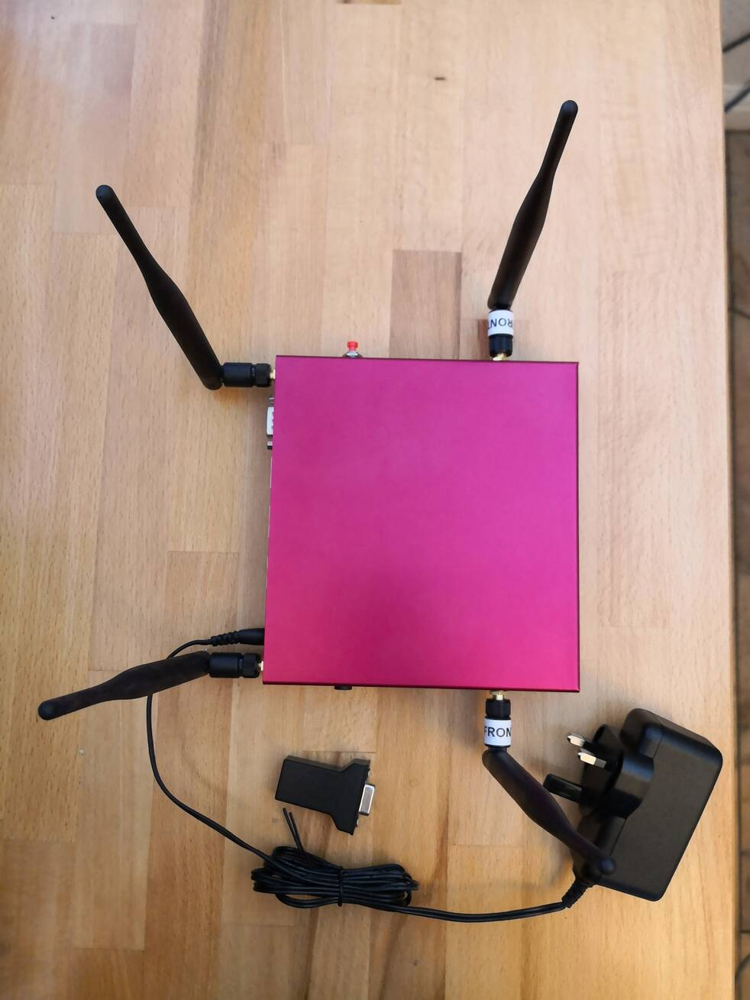

# Comissioning an APU2-based server

## Components

From left to right:

* APU2 server
* 2x Wifi Antennae: These screw into the rear connectors nearest the ports
* 2x LTE Antennae: These screw into the side connectors nearest the front LEDs
* Serial USB adapter: This adapter allows you to connect another computer to the server for debugging
* 12v Power supply: Connects to the rear of the unit nearest the USB ports

* 2x heatsinks: These attach to the WiFi and LTE modem to keep them cool

## Inserting a SIM card

1. Unscrew the 4 screws in each corner:

  

2. Lift lid, being careful of the wires attaching the top to the bottom.

  

3. Peel backing off heatsinks and stick to areas marked with red squares.

  

4. Push SIM card metal-side up into slot at the front of the unit:

  

5. Press in until the SIM card clicks into place:

  

7. Put lid back, reattach screws.

## Attaching antennae and PSU

1. Screw in the 2 antennae labelled "Front" to the side of the unit nearest the lights, point them upwards
2. Screw in the other 2 antennae into the back of the unit, point them upwards
3. Attach the PSU to the back of the unit to the right
4. It is not generally necessary to attach the serial USB adapter, but if needed it connects to the leftmost port

## Powering on the server

The server should power on automatically when plugged in, if not press the red button on the side of the unit.

A series of 5 high-pitched beeps will indicate it is ready for use.

## Powering off the server

Press the red button on the side of the unit, wait for the lights on the side to go out. The power can now be removed.

## Changing APN for SIM card

To access the internet, the server needs an [APN](https://en.wikipedia.org/wiki/Access_Point_Name) that matches the SIM card.
The details to use vary depending on network operator.
Either search for APN on the provider's site, or see one of the following sites for information:

*  https://apn.how
* https://gitlab.gnome.org/GNOME/mobile-broadband-provider-info/-/blob/main/serviceproviders.xml

Go to http://eias.lan/scripts/configure-mbim to enter the details:

* ``APN_AUTH``: Blank if no user/password need to be provided, otherwise try "PAP".
* ``PROXY``: Leave blank.

More information on the settings [can be found here](https://man.archlinux.org/man/mbim-network.1.en).
